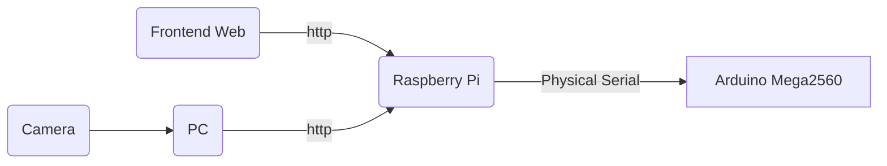

# ELEC3848_gp
## Group E12
## Overall
### Data flow of our project

-   **Camera**: Using OpenCV to collect data and send the frames to the PC for model inference.
-   **PC**: Analyzing data and sending the coordinates of the car and suspicious items to the Raspberry Pi for further analysis.
-   **Frontend Web Page**: This serves as the remote control for workers to remotely activate and stop the car (Arduino).
-   **Raspberry Pi**: It continuously listens to the client for commands to wake up or stop. Once awakened, it receives data from the PC to calculate the car's route and sends instructions to Arduino through the physical serial port.
-   **Arduino Mega2560**: Receives data from the Raspberry Pi and moves according to the instructions.
## Item Recognition with OpenCV
### Environment setting
It is recommended to create a virtual environment with **Conda** and run the program in the virtual environment.
Here are some steps for reference: (suppose you already have `conda`)
1.  Check environment: `conda env list`
2.  Create a new environment (here is): 
    ```
    conda create -n py36tqrcode numpy pandas python=3.9
    ```
    This command creates a new environment called `py36tqrcode` in the conda environment and installs the Python 3.9, NumPy, and Pandas packages in that environment.
4.  Activate the environment: `conda activate py36tqrcode`
5.  Deactive the environment: `conda deactivate`
6. Please make sure that your Python interpreter is corresponding to your python environment. eg:
    ```
    (py36tqrcode) ➜  desktop git:(main) ✗ conda env list
    # conda environments:
    #
    py36tqrcode           *  /Users/wodepingguo/opt/anaconda3/envs/py36tqrcode
    ```
    then
    ```
    (py36tqrcode) ➜  desktop git:(main) ✗ /Users/Username/opt/anaconda3/envs/py36tqrcode/bin/python $DocumentName.py
    ```
### Import the required libraries
The code imports the necessary libraries for image processing, numerical computations, time operations, and sending HTTP requests. 
```
import cv2 
import numpy as np 
import time import requests
```
### Define the object detection function
This function takes a frame (image) as input and performs object detection using color thresholds.
def detect_object(frame):
1. Convert the frame to the HSV color space, creates masks based on pre-defined red and yellow thresholds:
    ```
    # Convert BGR to HSV
    hsv = cv2.cvtColor(frame, cv2.COLOR_BGR2HSV)

    # Define the range of red color in HSV
    lower_red = np.array([0, 100, 100])
    upper_red = np.array([10, 255, 255])

    # Define the range of yellow color in HSV
    lower_yellow = np.array([20, 100, 100])
    upper_yellow = np.array([30, 255, 255])

    # Threshold the HSV image to get only red colors
    red_mask = cv2.inRange(hsv, lower_red, upper_red)

    # Threshold the HSV image to get only yellow colors
    yellow_mask = cv2.inRange(hsv, lower_yellow, upper_yellow)
    ```
2. Find the largest contours in each mask:
    ```
    # Process red contours
    for contour in red_contours:
        area = cv2.contourArea(contour)
        if area > 100:
            if area > largest_red_area:
                largest_red_area = area
                largest_red_contour = contour

    # Process yellow contours
    for contour in yellow_contours:
        area = cv2.contourArea(contour)
        if area > 100:
            if area > largest_yellow_area:
                largest_yellow_area = area
                largest_yellow_contour = contour
    ```
3. Draw bounding boxes around the objects, calculate the center coordinates of the objects, and print them:
    ```
    # Draw rectangle around the largest red object
    if largest_red_contour is not None:
        x, y, w, h = cv2.boundingRect(largest_red_contour)
        cv2.rectangle(frame, (x, y), (x + w, y + h), (0, 255, 0), 2)

        # Calculate the center of the rectangle
        red_center_x = x + w // 2
        red_center_y = frame.shape[0] - (y + h // 2)  # Invert y coordinate

        print("Red coordinates:", red_center_x, red_center_y)
    else:
        red_center_x, red_center_y = 0, 0

    # Draw rectangle around the largest yellow object
    if largest_yellow_contour is not None:
        x, y, w, h = cv2.boundingRect(largest_yellow_contour)
        cv2.rectangle(frame, (x, y), (x + w, y + h), (0, 255, 255), 2)

        # Calculate the center of the rectangle
        yellow_center_x = x + w // 2
        yellow_center_y = frame.shape[0] - (y + h // 2)  # Invert y coordinate

        print("Yellow coordinates:", yellow_center_x, yellow_center_y)
    else:
        yellow_center_x, yellow_center_y = 0, 0
    ```
4. Send the coordinate through http request
    ```
    response_post = requests.post(server_address, data={'message': message})
    ```
    Check if the request was successful (status code 200)
    ```
    if response_post.status_code == 200: 
        print("Server Response:") 
        print(response_post.text) 
    else: 
        print(f"Error: Server returned status code {response_post.status_code}")
    ```
5. Optimizer
   - detection_interval setting:
       ```
       detection_interval = n  # Run detection every 10 frames

        frame_count = 0

        while cap.isOpened():
            ret, frame = cap.read()

            frame_count += 1

            if frame_count % detection_interval == 0:
                center_x, center_y, yellow_x, yellow_y = detect_object(frame)
       ```
## Communication
### Serial communication [1]
1. Raspverry Side
    1. Install necessary python packages: `sudo apt-get install python-serial` and `sudo apt-get install arduino`.
    2. Check the usb devices connected to Raspberry Pi: `lsusb`to search for connection information and check whether the port exists.
        ```
        def find_arduino_port():
            ports = serial.tools.list_ports.grep("1a86:7523")
            for port, desc, hwid in ports:
                return port
            return None
        ```
    3. If the port does exists, then need to try to send and receive messages. A sample code is like:
        ```
        try: 
            while 1: 
                res=ser.readline() #read in data and print 
                print(res) #send the data
                time.sleep(1) 
                ser.write("Hello! I am Raspberry!".encode("utf-8"))
        except: 
            ser.close()
        ```
    4. However, since Raspberry Pi need keep sending command to Arduino, we need to add a tag outside like:
        ```
        if arduino_port:
        try:
            ser = serial.Serial(arduino_port, 9600, timeout=1)
            print("ser.is_open")

            # send data to Arduino
            tag = 0
            while (tag == 0):
                print("msg sent", msg)
                ser.write(msg.encode('utf-8'))

                # wait for a while, to make sure Arduino have enough time to process data & reply
                time.sleep(3)

                # read in Arduino reply
                res=ser.readline()
                if (res):
                   # print reply
                    response_str = res.decode('utf-8')
                    print("res:", response_str)
                    tag = 1
                else:
                    print("no response yet")
        except serial.SerialException as e:
            print(f"Serial error: {e}")
        finally:
            # close
            ser.close()
        ```
    5. Make sure Arduino and Raspberry are in the same baud rate and the frequency of sending and receieving data should be carefully considered.
    6. Arduino
        ```
        void waitForPythonMessage() {
          String str = "";
          while (Serial.available()) {
            // sendResponseToPython("aaa");
            char ch = Serial.read();
            str += ch;
            delay(10);
          }
          if (str.length() > 0) {
              // command that received
              processCommand(str);
              // send response to Python
              sendResponseToPython("Message received!");
            }
         }
        ```
3. Python msg send function: `send_msg("("+str(i)+")")`, plz be aware that the string must be included in the bracket since Arduino read data character by character.

### HTTP Communication in the Same WLAN
#### Basic http function
- One computer serves as the server, while another functions as the client. Run an HTTP server program on the server side and then execute an HTTP client program on the client side to facilitate communication with the server.
- Before running these two programs, ensure that both computers are on the same network and can access each other. You can use the IP address of one computer to replace the address in server_address.
- Find the server's IP address by using ifconfig/ipconfig (Mac/Windows). In this case, we are using Windows as the server.
- Obtain the IP address by searching for "Wireless LAN Adapter".
    ```
    Wireless LAN adapter WLAN:
    Connection specific DNS suffix . . . : 
    IPv4 address. . . . . . . . . . . . .: 192.168.1.20 
    Subnet mask  . . . . . . . . . . . . : 255.255.255.0 
    Default gateway. . . . . . . . . . . : 192.168.1.1
    ```
    Replace the IP address in the WLAN section
- Attention
    - No VPN
    - For errors like `OSError: [WinError 10048] 通常每个套接字地址(协议/网络地址/端口)只允许使用一次。`means port are not available.
    - Start the Server first, then the client
- Sample
    HTTP Server
    ```
    from http.server import SimpleHTTPRequestHandler
    from socketserver import TCPServer

    # Specify server address and port
    host = '0.0.0.0'  # Can be a specific IP address, or 0.0.0.0 to accept any available network interface
    port = 8888

    # Set up server
    server_address = (host, port)
    httpd = TCPServer(server_address, SimpleHTTPRequestHandler)

    # Print server information
    print(f"Serving on {host}:{port}")

    # Start the server
    httpd.serve_forever()
    ```
- HTTP Client
    ```
    import requests

    # Server address and port
    server_address = 'http://192.168.1.20:8888' 

    # Send HTTP GET request
    response = requests.get(server_address)

    # Print server response
    print("Server Response:")
    print(response.text)
    ```
- Running result (sample)：
    </br> server： 
    <p align=center></p>
    </br> client：
    <p align=center></p>

#### **Server Side**: Flask

   Our server is designed based on Python `Flask`, all the request from client should be `POST` request, the `process_client_data` function will read and send the specific message to Arduino.  
   
    def process_client_data():
        received_data = request.form.get('message')
        print("Received from client:", received_data)
        # hand the received_data through content
        response_to_client = "Message received by server"
        return response_to_client
        
    # Define routes and handle GET and POST requests
    @app.route('/', methods=['GET', 'POST'])
    def index():
        if request.method == 'GET':
            # Handle client's GET request
            return "Server is ready to receive messages"
        elif request.method == 'POST':
            # Process the client's POST request and call the encapsulated function
            return process_client_data()

#### Frontend: Remote control
The request sent from the front-end web page is through Javascript:
```
fetch(serverAddress, {
                method: 'POST',
                headers: {
                    'Content-Type': 'application/x-www-form-urlencoded',
                },
                body: 'message=' + message,
            })
                .then(response => response.text())
                .then(data => {
                    console.log('Server Response:', data);
                })
                .catch(error => {
                    console.error('Error:', error);
                });
```
The request will be sent as the click-button event is triggered.

[1]:https://codeantenna.com/a/2OhcDHzc2B 

