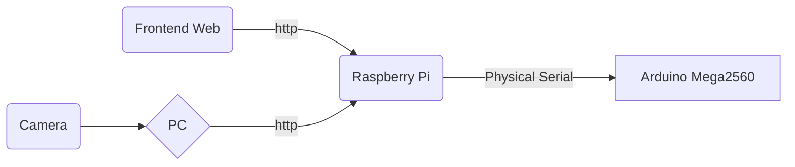

# ELEC3848_gp
## Group E12
## Overall structure of our project
### Data flow of our project

-   **Camera**: Using OpenCV to collect data and send the frames to the PC for model inference.
-   **PC**: Analyzing data and sending the coordinates of the car and suspicious items to the Raspberry Pi for further analysis.
-   **Frontend Web Page**: This serves as the remote control for workers to remotely activate and stop the car (Arduino).
-   **Raspberry Pi**: It continuously listens to the client for commands to wake up or stop. Once awakened, it receives data from the PC to calculate the car's route and sends instructions to Arduino through the physical serial port.
-   **Arduino Mega2560**: Receives data from the Raspberry Pi and moves according to the instructions.
# Item Recognition with OpenCV
## Environment setting
It is recommended to create a virtual environment with **Conda** and run the program in the virtual environment.
Here are some steps for reference: (suppose you already have `conda`)
1.  Check environment: `conda env list`
2.  Create a new environment (here is): 
    ```
    conda create -n py36tqrcode numpy pandas python=3.9
    ```
    This command creates a new environment called `py36tqrcode` in the conda environment and installs the Python 3.9, NumPy, and Pandas packages in that environment.
4.  Activate the environment: `conda activate py36tqrcode`
5.  Deactive the environment: `conda deactivate`
6. Please make sure that your Python interpreter is corresponding to your python environment. eg:
    ```
    (py36tqrcode) ➜  desktop git:(main) ✗ conda env list
    # conda environments:
    #
    base                     /Users/wodepingguo/opt/anaconda3
    keras                    /Users/wodepingguo/opt/anaconda3/envs/keras
    py36tf1                  /Users/wodepingguo/opt/anaconda3/envs/py36tf1
    py36tqrcode           *  /Users/wodepingguo/opt/anaconda3/envs/py36tqrcode
    tensorflow               /Users/wodepingguo/opt/anaconda3/envs/tensorflow
    ```
    then
    ```
    (py36tqrcode) ➜  desktop git:(main) ✗ /Users/wodepingguo/opt/anaconda3/envs/py36tqrcode/bin/python QRcode.py
    ```
## Communication
### Serial communication
1. Python  msg send function: `send_msg("("+str(i)+")")`, plz be aware that the string must be included in the bracket.
2. Arduino may process the instruction in `processCommand(String commond)` function.
### HTTP Communication in the Same WLAN
- One computer serves as the server, while another functions as the client. Run an HTTP server program on the server side and then execute an HTTP client program on the client side to facilitate communication with the server.
- Before running these two programs, ensure that both computers are on the same network and can access each other. You can use the IP address of one computer to replace the address in server_address.
- Find the server's IP address by using ifconfig/ipconfig (Mac/Windows). In this case, we are using Windows as the server.
- Obtain the IP address by searching for "Wireless LAN Adapter".
    ```
    无线局域网适配器 WLAN:

       连接特定的 DNS 后缀 . . . . . . . :
       IPv4 地址 . . . . . . . . . . . . : 192.168.1.20
       子网掩码  . . . . . . . . . . . . : 255.255.255.0
       默认网关. . . . . . . . . . . . . : 192.168.1.1
    ```
    Replace the IP address in the WLAN section
- Attention
    - No VPN
    - For errors like `OSError: [WinError 10048] 通常每个套接字地址(协议/网络地址/端口)只允许使用一次。`means port are not available.
    - Start the Server first, then the client
#### Sample
HTTP Server
```
from http.server import SimpleHTTPRequestHandler
from socketserver import TCPServer

# 指定服务器地址和端口
host = '0.0.0.0'  # 可以是具体的IP地址，也可以是0.0.0.0表示接受任何可用的网络接口
port = 8888

# 设置服务器
server_address = (host, port)
httpd = TCPServer(server_address, SimpleHTTPRequestHandler)

# 打印服务器信息
print(f"Serving on {host}:{port}")

# 启动服务器
httpd.serve_forever()
```
HTTP Client
```
import requests

# 服务器地址和端口
server_address = 'http://192.168.1.20:8888'  # 请替换为你的服务器地址和端口

# 发送HTTP GET请求
response = requests.get(server_address)

# 打印服务器响应
print("Server Response:")
print(response.text)
```
Running result (sample)：
</br> server： 
<p align=center></p>
</br> client：
<p align=center></p>

