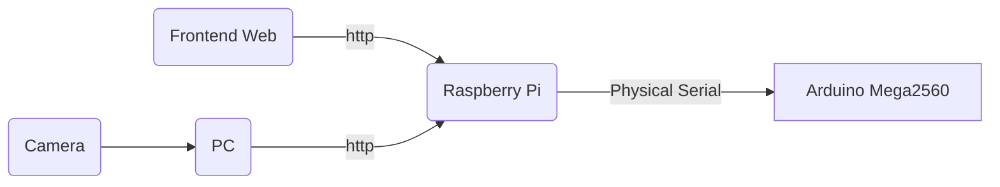

# ELEC3848_gp
## Group E12
## Overall
### Data flow of our project

-   **Camera**: Using OpenCV to collect data and send the frames to the PC for model inference.
-   **PC**: Analyzing data and sending the coordinates of the car and suspicious items to the Raspberry Pi for further analysis.
-   **Frontend Web Page**: This serves as the remote control for workers to remotely activate and stop the car (Arduino).
-   **Raspberry Pi**: It continuously listens to the client for commands to wake up or stop. Once awakened, it receives data from the PC to calculate the car's route and sends instructions to Arduino through the physical serial port.
-   **Arduino Mega2560**: Receives data from the Raspberry Pi and moves according to the instructions.
## Item Recognition with OpenCV
### Environment setting
It is recommended to create a virtual environment with **Conda** and run the program in the virtual environment.
Here are some steps for reference: (suppose you already have `conda`)
1.  Check environment: `conda env list`
2.  Create a new environment (here is): 
    ```
    conda create -n py36tqrcode numpy pandas python=3.9
    ```
    This command creates a new environment called `py36tqrcode` in the conda environment and installs the Python 3.9, NumPy, and Pandas packages in that environment.
4.  Activate the environment: `conda activate py36tqrcode`
5.  Deactive the environment: `conda deactivate`
6. Please make sure that your Python interpreter is corresponding to your python environment. eg:
    ```
    (py36tqrcode) ➜  desktop git:(main) ✗ conda env list
    # conda environments:
    #
    py36tqrcode           *  /Users/wodepingguo/opt/anaconda3/envs/py36tqrcode
    ```
    then
    ```
    (py36tqrcode) ➜  desktop git:(main) ✗ /Users/Username/opt/anaconda3/envs/py36tqrcode/bin/python $DocumentName.py
    ```
## Communication
### Serial communication [1]
1. Raspverry Side
    1. Install necessary python packages: `sudo apt-get install python-serial` and `sudo apt-get install arduino`.
    2. Check the usb devices connected to Raspberry Pi: `lsusb`to search for connection information and check whether the port exists.
        ```
        def find_arduino_port():
            ports = serial.tools.list_ports.grep("1a86:7523")
            for port, desc, hwid in ports:
                return port
            return None
        ```
    3. If the port does exists, then need to try to send and receive messages. A sample code is like:
        ```
        try: 
            while 1: 
                res=ser.readline() #读取数据并打印 
                print(res) #串口发送数据 
                time.sleep(1) 
                ser.write("Hello! I am Raspberry!".encode("utf-8"))
        except: 
            ser.close()
        ```
    4. However, since Raspberry Pi need keep sending command to Arduino, we need to add a tag outside like:
        ```
        if arduino_port:
        try:
            ser = serial.Serial(arduino_port, 9600, timeout=1)
            print("ser.is_open")

            # 向Arduino发送消息
            tag = 0
            while (tag == 0):
                print("msg sent", msg)
                ser.write(msg.encode('utf-8'))

                # 等待一段时间，以确保Arduino有足够的时间处理消息并发送回复
                time.sleep(3)

                # 读取Arduino的回复
                res=ser.readline()
                if (res):
                   # 打印回复消息
                    response_str = res.decode('utf-8')
                    print("res:", response_str)
                    tag = 1
                else:
                    print("no response yet")
        except serial.SerialException as e:
            print(f"Serial error: {e}")
        finally:
            # 关闭串口连接
            ser.close()
        ```
    5. Make sure Arduino and Raspberry are in the same baud rate and the frequency of sending and receieving data should be carefully considered.
    6. Arduino
        ```
        void waitForPythonMessage() {
          String str = "";
          while (Serial.available()) {
            // sendResponseToPython("aaa");
            char ch = Serial.read();
            str += ch;
            delay(10);
          }
          if (str.length() > 0) {
              // 处理接收到的命令
              processCommand(str);
              // 发送响应回到Python
              sendResponseToPython("Message received!");
            }
         }
        ```
3. Python msg send function: `send_msg("("+str(i)+")")`, plz be aware that the string must be included in the bracket since Arduino read data character by character.

### HTTP Communication in the Same WLAN
#### Basic http function
- One computer serves as the server, while another functions as the client. Run an HTTP server program on the server side and then execute an HTTP client program on the client side to facilitate communication with the server.
- Before running these two programs, ensure that both computers are on the same network and can access each other. You can use the IP address of one computer to replace the address in server_address.
- Find the server's IP address by using ifconfig/ipconfig (Mac/Windows). In this case, we are using Windows as the server.
- Obtain the IP address by searching for "Wireless LAN Adapter".
    ```
    无线局域网适配器 WLAN:
       连接特定的 DNS 后缀 . . . . . . . :
       IPv4 地址 . . . . . . . . . . . . : 192.168.1.20
       子网掩码  . . . . . . . . . . . . : 255.255.255.0
       默认网关. . . . . . . . . . . . . : 192.168.1.1
    ```
    Replace the IP address in the WLAN section
- Attention
    - No VPN
    - For errors like `OSError: [WinError 10048] 通常每个套接字地址(协议/网络地址/端口)只允许使用一次。`means port are not available.
    - Start the Server first, then the client
- Sample
    HTTP Server
    ```
    from http.server import SimpleHTTPRequestHandler
    from socketserver import TCPServer

    # 指定服务器地址和端口
    host = '0.0.0.0'  # 可以是具体的IP地址，也可以是0.0.0.0表示接受任何可用的网络接口
    port = 8888

    # 设置服务器
    server_address = (host, port)
    httpd = TCPServer(server_address, SimpleHTTPRequestHandler)

    # 打印服务器信息
    print(f"Serving on {host}:{port}")

    # 启动服务器
    httpd.serve_forever()
    ```
- HTTP Client
    ```
    import requests

    # 服务器地址和端口
    server_address = 'http://192.168.1.20:8888'  # 请替换为你的服务器地址和端口

    # 发送HTTP GET请求
    response = requests.get(server_address)

    # 打印服务器响应
    print("Server Response:")
    print(response.text)
    ```
- Running result (sample)：
    </br> server： 
    <p align=center></p>
    </br> client：
    <p align=center></p>

#### **Server Side**: Flask

   Our server is designed based on Python `Flask`, all the request from client should be `POST` request, the `process_client_data` function will read and send the specific message to Arduino.  
   
    def process_client_data():
        received_data = request.form.get('message')
        print("Received from client:", received_data)
        # hand the received_data through content
        response_to_client = "Message received by server"
        return response_to_client
        
    # 定义路由，处理GET和POST请求
    @app.route('/', methods=['GET', 'POST'])
    def index():
        if request.method == 'GET':
            # 处理客户端的GET请求
            return "Server is ready to receive messages"
        elif request.method == 'POST':
            # 处理客户端的POST请求，调用封装的函数
            return process_client_data()

#### Frontend: Remote control
The request sent from the front-end web page is through Javascript:
```
fetch(serverAddress, {
                method: 'POST',
                headers: {
                    'Content-Type': 'application/x-www-form-urlencoded',
                },
                body: 'message=' + message,
            })
                .then(response => response.text())
                .then(data => {
                    console.log('Server Response:', data);
                })
                .catch(error => {
                    console.error('Error:', error);
                });
```
The request will be sent as the click-button event is triggered.

[1]:https://codeantenna.com/a/2OhcDHzc2B 


